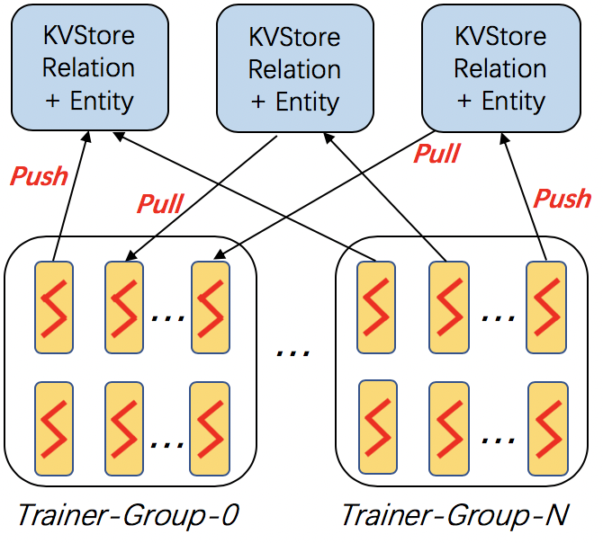
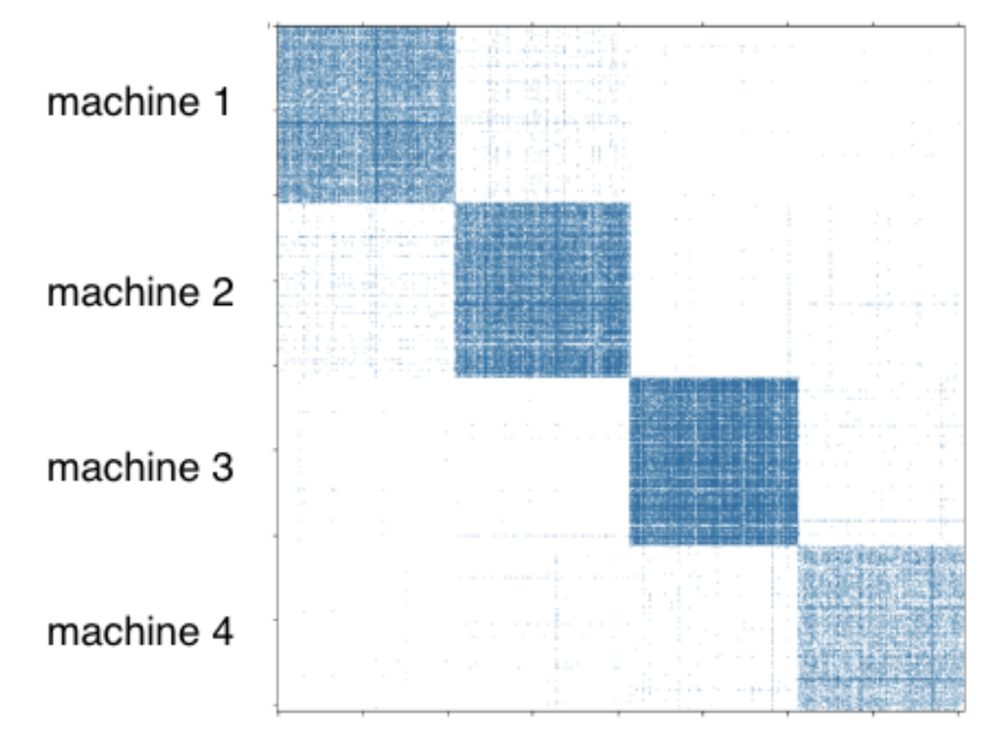

Distributed Training on Large Data
------------------------------------

In the previous sections, we saw that using multiple GPUs within a machine can accelerate training. The speedup, however, is limited by the number of GPUs installed in that machine. The ever-growing size of knowledge graphs requires computation capable of scaling to graphs with millions of nodes and billions of edges.

DGL-KE supports distributed training that allows users to train their tasks in the cluster. In this tutorial, we will demonstrate how to set up a 4-machines cluster and how to use DGL-KE to train KG embeddings on this cluster.

Architecture of Distributed Training
^^^^^^^^^^^^^^^^^^^^^^^^^^^^^^^^^^^^^

DGL-KE adopts the *parameter-server* architecture for distributed training. 

In this architecture, the entity embeddings and relation embeddings are stored in DGL-KVStore, and the trainer processes can pull the latest model from KVStore and push the calculated gradient to the KVStore. All the processes will train the KG embeddings in an *async* way.

METIS Partition Algorithm
^^^^^^^^^^^^^^^^^^^^^^^^^^

In distributed training, all the training processes will communicate with KVStore through the network. This could bring a large amount of networking traffic and overhead. DGL-KE uses the `METIS graph partition`__ algorithm to solve this problem. For a cluster of ``P`` machines, we split the graph into ``P`` partitions using the METIS partition to a machine (all entities and triplets incident to the entities) to a machine as shown in the following Figure.

.. __: http://glaros.dtc.umn.edu/gkhome/metis/metis/overview

The majority of the triplets are in the diagonal blocks. We co-locate the embeddings of the entities with the triplets in the diagonal block by specifying a proper data partitioning in the distributed KVStore. When a trainer process samples triplets in the local partition, most of the entity embeddings accessed by the batch fall in the local partition and, thus, there is little network communication to access entity embeddings from other machines.

Distributed Training by DGL-KE
^^^^^^^^^^^^^^^^^^^^^^^^^^^^^^^

Distributed training on DGL-KE usually involves three steps:

  1. Partition a knowledge graph.
  2. Copy partitioned data to remote machines.
  3. Invoke the distributed training job by ``dglke_dist_train``.

Here we demonstrate how to training KG embedding on ``FB15k`` dataset using 4 machines. Note that, the ``FB15k`` is just a small dataset as out toy demo. An interested user can try it on ``Freebase``, which contains *86M* nodes and *338M* edges.

**Step 1: Prepare your machines**

Assume that we have four machines with the following IP addresses::

    machine_0: 172.31.24.245
    machine_1: 172.31.24.246
    machine_2: 172.31.24.247
    machine_3: 172.32.24.248

Make sure that *machine_0* has the permission to *ssh* to all the other machines. 

**Step 2: Prepare your data**

Create a new directory called ``my_task`` on machine_0::

    mkdir my_task

We use built-in ``FB15k`` as demo and paritition it into ``4`` parts::

    dglke_partition --dataset FB15k -k 4 --data_path ~/my_task

Note that, in this demo, we have 4 machines so we set ``-k`` to 4. After this step, we can see 4 new directories called ``partition_0``, ``partition_1``, ``partition_2``, and ``partition_3`` in your ``FB15k`` dataset folder.

Create a new file called ``ip_config.txt`` in ``my_task``, and write the following contents into it::

    172.31.24.245 30050 8
    172.31.24.246 30050 8
    172.31.24.247 30050 8
    172.32.24.248 30050 8

Each line in ``ip_config.txt`` is the KVStore configuration on each machine. For example, ``172.31.24.245 30050 8`` represents that, on ``machine_0``, the IP is ``172.31.24.245``, the base port is ``30050``, and we start ``8`` servers on this machine. Note that, you can change the number of servers on each machine based on your machine capabilities. In our environment, the instance has ``48`` cores, and we set ``8`` cores to KVStore and ``40`` cores for worker processes.

After that, we can copy the ``my_task`` directory to all the remote machines::

    scp -r ~/my_task 172.31.24.246:~
    scp -r ~/my_task 172.31.24.247:~
    scp -r ~/my_task 172.31.24.248:~

**Step 3: Launch distributed jobs**

Run the following command on ``machine_0`` to start a distributed task::

    dglke_dist_train --path ~/my_task --ip_config ~/my_task/ip_config.txt \
    --num_client_proc 16 --model_name TransE_l2 --dataset FB15k --data_path ~/my_task --hidden_dim 400 \
    --gamma 19.9 --lr 0.25 --batch_size 1000 --neg_sample_size 200 --max_step 500 --log_interval 100 \
    --batch_size_eval 16 --test -adv --regularization_coef 1.00E-09 --num_thread 1

Most of the options we have already seen in previous sections. Here are some new options we need to know. 

``--path`` indicates the absolute path of our workspace. All the logs and trained embedding will be stored in this path.

``--ip_config`` is the absolute path of ``ip_config.txt``.

``--num_client_proc`` has the same behaviors to ``--num_proc`` in single-machine training.

All the other options are the same as single-machine training. For some EC2 users, you can also set ``--ssh_key`` for right *ssh* permission.

If you don't set ``--no_save_embed`` option. The trained KG embeddings will be stored in ``machine_0`` by default.