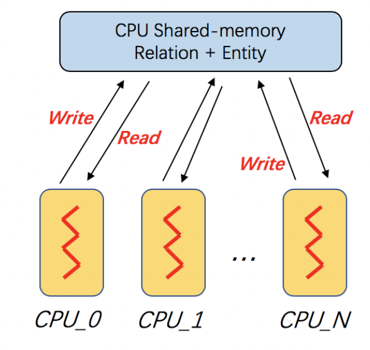
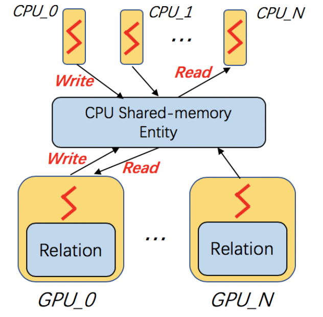
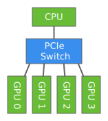

DGL-KE Command Line
----------------------------------

DGL-KE provides four commands to users:

``dglke_train`` trains KG embeddings on CPUs or GPUs in a single machine and saves the trained node embeddings and relation embeddings into the file. 

``dglke_eval`` reads the pre-trained embeddings and evaluates the embeddings with a link prediction task on the test set. This is a common task used for evaluating the quality of pre-trained KG embeddings.

``dglke_partition`` partitions the given knowledge graph into ``N`` parts by the METIS partition algorithm. Different partitions will be stored on different machines in distributed training. You can find more details about the METIS partition algorithm in this `link`__.

.. __: http://glaros.dtc.umn.edu/gkhome/metis/metis/overview

``dglke_dist_train`` launches a set of processes in the cluster for distributed training.

Training on Multi-Core
^^^^^^^^^^^^^^^^^^^^^^^

Multi-core processors are very common and widely used in modern computer architecture. DGL-KE is optimized on multi-core processors for the best system performance. In DGL-KE, we uses multi-processes instead of multi-threads for parallel training. In this design, the enity embeddings and relation embeddings will be stored in a global shared-memory and all the trainer processes can read and write it. All the processes will train the global model in a *Hogwild* style.

The following command trains the ``transE`` model on ``FB15k`` dataset on a multi-core machine::

  dglke_train --model_name TransE_l2 --dataset FB15k --batch_size 1000 --neg_sample_size 200 --hidden_dim 400 \
  --gamma 19.9 --lr 0.25 --max_step 3000 --log_interval 100 --batch_size_eval 16 --test -adv \
  --regularization_coef 1.00E-09 --num_thread 1 --num_proc 8

After training, you will see the following messages::

    -------------- Test result --------------
    Test average MRR : 0.6520483281422476
    Test average MR : 43.725415178344704
    Test average HITS@1 : 0.5257063533713666
    Test average HITS@3 : 0.7524081190431853
    Test average HITS@10 : 0.8479202993008413
    -----------------------------------------

``--num_proc`` indicates that we will launch ``8`` processes in parallel for the training task, and ``--num_thread`` indicates that each process will use ``1`` thread. Typically, ``num_proc * num_thread`` is ``<=`` the ``number_of_cores`` of the current machine. For example, when the number of processes is the same as the number of CPU cores, the user should use just ``1`` thread in each process for the best. performance.

``--model_name`` is used to specify our model, including ``TransE_l2``, ``TransE_l1``, ``DistMult``, ``ComplEx``, ``TransR``, ``RESCAL``, and ``RotatE``. More models will be added in the future.

``--dataset`` is used to choose a built-in KG dataset, including ``FB15k``, ``FB15k-237``, ``wn18``, ``wn18rr``, and ``Freebase``. See more details about the built-in KG dataset on this `page`__.

.. __: ./train_built_in.html

DGL-KE uses *mini-batch SGD* training. The ``--batch_size`` and ``--neg_batch_size`` are the hyper-parameters used for training. The ``--batch_size_eval`` is the hyper-parameter used for the test.

``--hidden_dim`` indicates the dimension size of the KG embeddings. ``--gamma`` is a hyper-parameter used to initialize embeddings. ``--regularization_coef`` is the hyper-parameter used for regularization.

``--lr`` is learning rate used for our optimization algorithm. ``--max_step`` defines the maximal learning steps. Note that, the total number of steps in our training task is ``max_step * num_proc``. With multi-processing, we need to adjust the number of ``--max_step`` in each process. Usually, we only need the total number of steps performed by all processes equal to the number of steps performed in the single-process training.

``-adv`` indicates whether to use negative adversarial sampling, which will weight negative samples with higher scores more.

``--log_interval`` indicates that on every ``100`` steps we print the training loss on the screen like this::

  [proc 7][Train](2900/3000) average pos_loss: 0.2691971030831337
  [proc 7][Train](2900/3000) average neg_loss: 0.3952002424001694
  [proc 7][Train](2900/3000) average loss: 0.33219867378473283
  [proc 7][Train](2900/3000) average regularization: 0.001801597059238702
  [proc 7][Train] 100 steps take 8.903 seconds
  [proc 7]sample: 0.264, forward: 6.140, backward: 1.942, update: 0.555
  [proc 4][Train](2900/3000) average pos_loss: 0.2709790524840355
  [proc 4][Train](2900/3000) average neg_loss: 0.397322960793972
  [proc 4][Train](2900/3000) average loss: 0.3341510048508644
  [proc 4][Train](2900/3000) average regularization: 0.0018006288178730756
  [proc 4][Train] 100 steps take 8.906 seconds
  [proc 4]sample: 0.254, forward: 6.087, backward: 1.989, update: 0.575
  [proc 4][Train](3000/3000) average pos_loss: 0.27121892631053923
  [proc 5][Train](3000/3000) average pos_loss: 0.2708482551574707
  [proc 4][Train](3000/3000) average neg_loss: 0.396016526222229
  [proc 5][Train](3000/3000) average neg_loss: 0.39040900617837904
  [proc 4][Train](3000/3000) average loss: 0.3336177259683609
  [proc 5][Train](3000/3000) average loss: 0.3306286296248436
  [proc 4][Train](3000/3000) average regularization: 0.0018079591123387217
  [proc 5][Train](3000/3000) average regularization: 0.0018065990647301079
  [proc 0][Train](3000/3000) average pos_loss: 0.2704304122924805
  [proc 1][Train](3000/3000) average pos_loss: 0.27033439934253695
  [proc 4][Train] 100 steps take 8.856 seconds

As we can see, every 100 steps will take almost ``8.9`` seconds on each process. We can compare this result with GPU training in the following sections.

``--test`` indicates that we will do an evaluation at the end.

After training, we can see a new directory ``ckpts/TransE_l2_FB15k_0``, which stores our training logs and trained KG embeddings. Users can set ``--no_save_emb`` to stop saving embedding to the file. 

Training on Powerful Workstation
^^^^^^^^^^^^^^^^^^^^^^^^^^^^^^^^^^^^^^

DGL-KE can efficiently train KG embeddings on the powerful workstation, which could have a large number of CPU cores. As an example, we start an ``r5dn.24xlarge`` instance on AWS EC2. This instance has 48 cores and 768 GB memory. The following command trains the previous ``transE`` model on this machine. Note that, as we use 48 cores in parallel, the ``--max_step`` will be decreased from ``3000`` to ``500``::

  dglke_train --model_name TransE_l2 --dataset FB15k --batch_size 1000 --neg_sample_size 200 --hidden_dim 400 \
  --gamma 19.9 --lr 0.25 --max_step 500 --log_interval 100 --batch_size_eval 16 --test -adv \
  --regularization_coef 1.00E-09 --num_thread 1 --num_proc 48

The training result::

    -------------- Test result --------------
    Test average MRR : 0.6342726325727872
    Test average MR : 45.80598770970527
    Test average HITS@1 : 0.5021922770902811
    Test average HITS@3 : 0.7371468233143167
    Test average HITS@10 : 0.8409794992466693
    -----------------------------------------

Training on single GPU
^^^^^^^^^^^^^^^^^^^^^^^

Training knowledge graph embeddings contains large numbers of tensor computation, which can be accelerated by GPU. DGL-KE can run on single-GPU, as well as the multi-GPU machine. Also, it can run in a *mix-gpu-cpu* environment, where the embedding data cannot be fit into GPU memory.

The following command trains the ``transE`` model on ``FB15k`` on a single GPU::

    dglke_train --model_name TransE_l2 --dataset FB15k --batch_size 1000 --log_interval 100 \
    --neg_sample_size 200 --regularization_coef=1e-9 --hidden_dim 400 --gamma 19.9 \
    --lr 0.25 --batch_size_eval 16 --test -adv --gpu 0 --max_step 24000

Most of the options here we have already seen in the previous section. The only difference is that we add ``--gpu 0`` to indicate that we will use 1 GPU to train our model. Compared to the cpu training, every 100 steps only takes ``0.72`` seconds on the Nvidia v100 GPU, which is much faster than ``8.9`` second in CPU training::

  [proc 0]sample: 0.165, forward: 0.282, backward: 0.217, update: 0.087
  [proc 0][Train](1900/24000) average pos_loss: 0.32798981070518496
  [proc 0][Train](1900/24000) average neg_loss: 0.45353577584028243
  [proc 0][Train](1900/24000) average loss: 0.3907627931237221
  [proc 0][Train](1900/24000) average regularization: 0.0012039361777715384
  [proc 0][Train] 100 steps take 0.726 seconds
  [proc 0]sample: 0.137, forward: 0.282, backward: 0.218, update: 0.087
  [proc 0][Train](2000/24000) average pos_loss: 0.31407852172851564
  [proc 0][Train](2000/24000) average neg_loss: 0.44177248477935793
  [proc 0][Train](2000/24000) average loss: 0.3779255014657974
  [proc 0][Train](2000/24000) average regularization: 0.0012163800827693194
  [proc 0][Train] 100 steps take 0.760 seconds
  [proc 0]sample: 0.171, forward: 0.282, backward: 0.218, update: 0.087
  [proc 0][Train](2100/24000) average pos_loss: 0.309254549741745
  [proc 0][Train](2100/24000) average neg_loss: 0.43288875490427015
  [proc 0][Train](2100/24000) average loss: 0.37107165187597274
  [proc 0][Train](2100/24000) average regularization: 0.0012251652684062719
  [proc 0][Train] 100 steps take 0.726 seconds
  [proc 0]sample: 0.136, forward: 0.283, backward: 0.219, update: 0.087
  [proc 0][Train](2200/24000) average pos_loss: 0.3109792047739029
  [proc 0][Train](2200/24000) average neg_loss: 0.4351910164952278
  [proc 0][Train](2200/24000) average loss: 0.3730851110816002
  [proc 0][Train](2200/24000) average regularization: 0.0012286945607047528
  [proc 0][Train] 100 steps take 0.732 seconds

Mix CPU-GPU training
^^^^^^^^^^^^^^^^^^^^^

By default, DGL-KE keeps all node and relation embeddings in GPU memory for single-GPU training. Therefore, it cannot train embeddings of large knowledge graphs because the capacity of GPU memory typically is much smaller than the CPU memory. So if your KG embedding is too large to fit into the GPU memory, you can use ``--mix_cpu_gpu`` training::

    dglke_train --model_name TransE_l2 --dataset FB15k --batch_size 1000 --log_interval 100 \
    --neg_sample_size 200 --regularization_coef=1e-9 --hidden_dim 400 --gamma 19.9 \
    --lr 0.25 --batch_size_eval 16 --test -adv --gpu 0 --max_step 24000 --mix_cpu_gpu

The ``--mix_cpu_gpu`` training will keep node and relation embeddings in CPU memory and perform batch computation in GPU. In this way, you can train very large KG embeddings as long as your cpu memory can handle it. While the training speed of *mix_cpu_gpu* training will be slower than pure GPU training::

   [proc 0][Train](8200/24000) average pos_loss: 0.2720812517404556
   [proc 0][Train](8200/24000) average neg_loss: 0.4004567116498947
   [proc 0][Train](8200/24000) average loss: 0.3362689846754074
   [proc 0][Train](8200/24000) average regularization: 0.0014934110222384334
   [proc 0][Train] 100 steps take 0.958 seconds
   [proc 0]sample: 0.133, forward: 0.339, backward: 0.185, update: 0.301
   [proc 0][Train](8300/24000) average pos_loss: 0.27434037417173385
   [proc 0][Train](8300/24000) average neg_loss: 0.40289842933416364
   [proc 0][Train](8300/24000) average loss: 0.33861940175294875
   [proc 0][Train](8300/24000) average regularization: 0.001497904829448089
   [proc 0][Train] 100 steps take 0.970 seconds
   [proc 0]sample: 0.145, forward: 0.339, backward: 0.185, update: 0.300
   [proc 0][Train](8400/24000) average pos_loss: 0.27482498317956927
   [proc 0][Train](8400/24000) average neg_loss: 0.40262984931468965
   [proc 0][Train](8400/24000) average loss: 0.3387274172902107
   [proc 0][Train](8400/24000) average regularization: 0.0015005254035349936
   [proc 0][Train] 100 steps take 0.958 seconds
   [proc 0]sample: 0.132, forward: 0.338, backward: 0.185, update: 0.301

As we can see, the *mix_cpu_gpu* training takes ``0.95`` seconds on every 100 steps. It is slower than pure GPU training (``0.73``) but still much faster than CPU (``8.9``).

Users can speed up the ``--mix_cpu_gpu`` training by using ``--async_update`` option. When using this option, the GPU device will not wait for the CPU to finish its job when it performs update operation::

    dglke_train --model_name TransE_l2 --dataset FB15k --batch_size 1000 --log_interval 100 \
    --neg_sample_size 200 --regularization_coef=1e-9 --hidden_dim 400 --gamma 19.9 \
    --lr 0.25 --batch_size_eval 16 --test -adv --gpu 0 --max_step 24000 --mix_cpu_gpu --async_update

We can see that trainnig time goes down from ``0.95`` to ``0.84`` seconds on every 100 steps::

  [proc 0][Train](22500/24000) average pos_loss: 0.2683987358212471
  [proc 0][Train](22500/24000) average neg_loss: 0.3919999450445175
  [proc 0][Train](22500/24000) average loss: 0.33019934087991715
  [proc 0][Train](22500/24000) average regularization: 0.0017611468932591378
  [proc 0][Train] 100 steps take 0.842 seconds
  [proc 0]sample: 0.161, forward: 0.381, backward: 0.200, update: 0.099
  [proc 0][Train](22600/24000) average pos_loss: 0.2682730385661125
  [proc 0][Train](22600/24000) average neg_loss: 0.39290413081645964
  [proc 0][Train](22600/24000) average loss: 0.3305885857343674
  [proc 0][Train](22600/24000) average regularization: 0.0017612565110903234
  [proc 0][Train] 100 steps take 0.838 seconds
  [proc 0]sample: 0.159, forward: 0.379, backward: 0.200, update: 0.098
  [proc 0][Train](22700/24000) average pos_loss: 0.2688949206471443
  [proc 0][Train](22700/24000) average neg_loss: 0.3927029174566269
  [proc 0][Train](22700/24000) average loss: 0.33079892098903657
  [proc 0][Train](22700/24000) average regularization: 0.0017607113404665142
  [proc 0][Train] 100 steps take 0.859 seconds

Training on Multi-GPU
^^^^^^^^^^^^^^^^^^^^^^^

DGL-KE also supports multi-GPU training, which can increase performance by distributing training across multiple GPU devices. The following figure depicts 4 GPUs on a single machine and connected to the CPU through a PCIe switch. Multi-GPU training automatically keeps node and relation embeddings on CPUs and dispatch batches to different GPUs.

The following command shows how to training our ``transE`` model using 4 Nvidia v100 GPUs jointly::

    dglke_train --model_name TransE_l2 --dataset FB15k --batch_size 1000 --log_interval 1000 \
    --neg_sample_size 200 --regularization_coef=1e-9 --hidden_dim 400 --gamma 19.9 \
    --lr 0.25 --batch_size_eval 16 --test -adv --gpu 0 1 2 3 --max_step 6000

Compared to single-GPU training, we change ``--gpu 0`` to ``--gpu 0 1 2 3``, and also we change ``--max_step`` from ``24000`` to ``6000``.

Users can add ``--async_update`` option for multi-GPU training. This optimization overlaps batch computation in GPU with gradient updates on CPU to speed up the overall training::

    dglke_train --model_name TransE_l2 --dataset FB15k --batch_size 1000 --log_interval 1000 \
    --neg_sample_size 200 --regularization_coef=1e-9 --hidden_dim 400 --gamma 19.9 \
    --lr 0.25 --batch_size_eval 16 --test -adv --gpu 0 1 2 3 --async_update --max_step 6000

``--async_update`` can increase system performance but it could slow down the model convergence. So DGL-KE provides another option called ``--force_sync_interval`` that forces all GPU sync their model on every ``N`` steps. For example, the following command will sync model across GPUs on every 1000 steps::

    dglke_train --model_name TransE_l2 --dataset FB15k --batch_size 1000 --log_interval 1000 \
    --neg_sample_size 200 --regularization_coef=1e-9 --hidden_dim 400 --gamma 19.9 \
    --lr 0.25 --batch_size_eval 16 --test -adv --gpu 0 1 2 3 --async_update --max_step 6000 --force_sync_interval 1000

Evaluation on Pre-Trained Embeddings
^^^^^^^^^^^^^^^^^^^^^^^^^^^^^^^^^^^^

By default, ``dglke_train`` saves the embeddings in the ``ckpts`` folder. Each runs creates a new folder in ``ckpts`` to store the training results. The new folder is named after ``xxxx_yyyy_zz``\ , where ``xxxx`` is the model name, ``yyyy`` is the dataset name, ``zz`` is a sequence number that ensures a unique name for each run. 

The saved embeddings are stored as numpy ndarrays. The node embedding is saved as ``XXX_YYY_entity.npy``.
The relation embedding is saved as ``XXX_YYY_relation.npy``. ``XXX`` is the dataset name and ``YYY`` is the model name.

A user can disable saving embeddings with ``--no_save_emb``. This might be useful for some cases, such as hyperparameter tuning.

``dglke_eval`` reads the pre-trained embeddings and evaluates the embeddings with a link prediction task on the test set. This is a common task used for evaluating the quality of pre-trained KG embeddings. The following command evaluates the pre-trained KG embedding on multi-cores::

    dglke_eval --model_name TransE_l2 --dataset FB15k --hidden_dim 400 --gamma 19.9 --batch_size_eval 16 \
    --num_thread 1 --num_proc 8 --model_path ~/my_task/ckpts/TransE_l2_FB15k_0/

We can also use GPUs in our evaluation tasks::

    dglke_eval --model_name TransE_l2 --dataset FB15k --hidden_dim 400 --gamma 19.9 --batch_size_eval 16 \
    --gpu 0 1 2 3 4 5 6 7 --model_path ~/my_task/ckpts/TransE_l2_FB15k_0/

