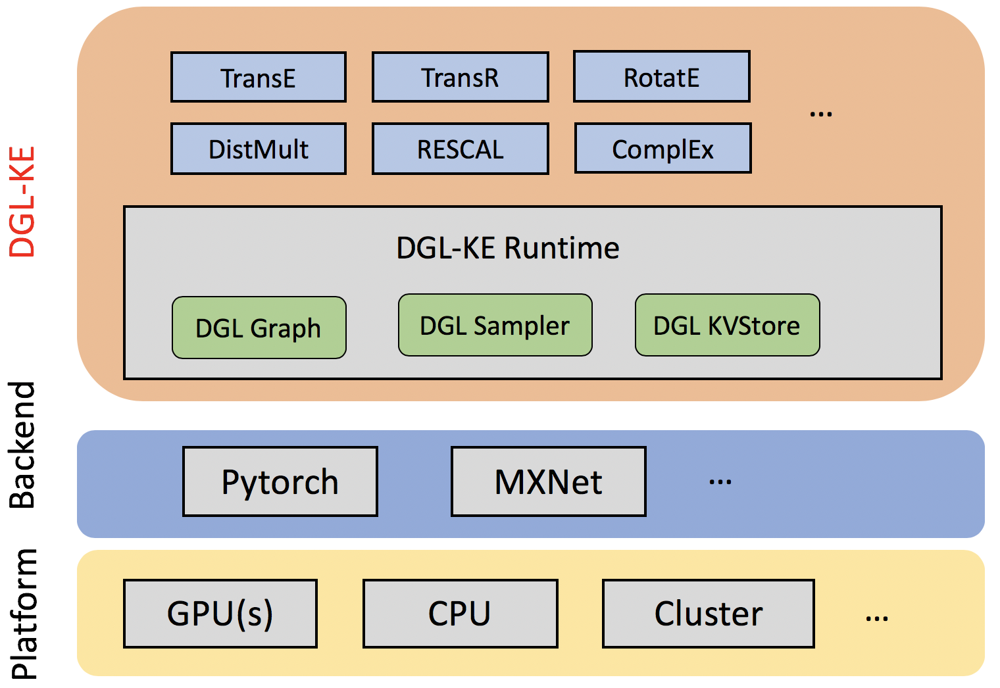

.. dglke documentation master file, created by
   sphinx-quickstart on Wed Apr  1 12:56:21 2020.
   You can adapt this file completely to your liking, but it should at least
   contain the root `toctree` directive.

DGL-KE Documentation
=================================

Knowledge graphs (KGs) are data structures that store information about different entities (nodes) and their relations (edges). A common approach of using KGs in various machine learning tasks is to compute knowledge graph embeddings. DGL-KE is a high performance, easy-to-use, and scalable package for learning large-scale knowledge graph embeddings. The package is implemented on the top of Deep Graph Library (DGL) and developers can run DGL-KE on CPU machine, GPU machine, as well as clusters with a set of popular models, including TransE, TransR, RESCAL, DistMult, ComplEx, and RotatE.

Get started with DGL-KE!
----------------------------------------

.. toctree::
   :glob:
   :maxdepth: 1

   self
   install
   hyper_param
   train_built_in
   train_user_data
   dist_train
