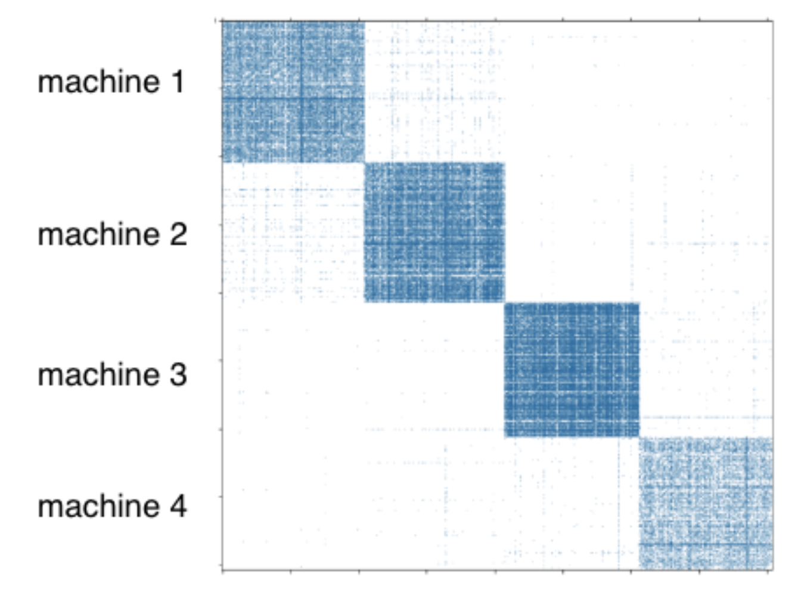

Partition a Knowledge Graph
===========================

For distributed training, a user needs to partition a graph beforehand. DGL-KE provides a partition tool ``dglke_partition``, which partitions a given knowledge graph into ``N`` parts with `the METIS partition algorithm`__. This partition algorithm minimizes edge cuts between partitions, which results in low network communication during the distributed training. For a cluster of ``P`` machines, we split the graph into ``P`` partitions using the METIS partition algorithm as shown in the following Figure.

.. __: http://glaros.dtc.umn.edu/gkhome/metis/metis/overview

The majority of the triplets are in the diagonal blocks. We co-locate the embeddings of the entities with the triplets in the diagonal block by specifying a proper data partitioning in the distributed KVStore. When a trainer process samples triplets in the local partition, most of the entity embeddings accessed by the batch fall in the local partition and, thus, there is little network communication to access entity embeddings from other machines.

Arguments
---------

  - ``--data_path DATA_PATH``
    The name of the knowledge graph stored under data_path. If it is one ofthe builtin knowledge grpahs such as FB15k, DGL-KE will automatically download the knowledge graph and keep it under data_path.

  - ``--dataset DATA_SET``
    The name of the knowledge graph stored under data_path. If it is one ofthe builtin knowledge grpahs such as FB15k, DGL-KE will automatically download the knowledge graph and keep it under data_path.

  - ``--data_files [DATA_FILES ...]``
    A list of data file names. This is used if users want to train KGE on their own datasets. If the format is *raw_udd_{htr}*, users need to provide *train_file* [*valid_file*] [*test_file*]. If the format is *udd_{htr}*, users need to provide *entity_file* *relation_file* *train_file* [*valid_file*] [*test_file*]. In both cases, *valid_file* and *test_file* are optional.

  - ``--delimiter DELIMITER``
    Delimiter used in data files. Note all files should use the same delimiter.

  - ``--format FORMAT``
    The format of the dataset. For builtin knowledge graphs,the foramt should be *built_in*. For users own knowledge graphs,it needs to be *raw_udd_{htr}* or *udd_{htr}*.

  - ``-k NUM_PARTS`` or ``--num-parts NUM_PARTS``
    The number of partitions.
